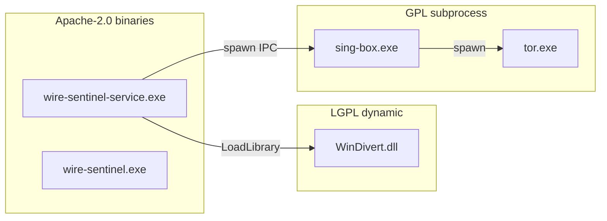

# WireSentinel License Audit Report

**Audit date:** 2026-06-24  
**Scope:** WireSentinel ecosystem (13 related repositories)  
**Auditor:** Automated + manual review per [license audit plan](../.cursor/plans/)

## Executive summary

| Result | Detail |
|--------|--------|
| **License violations** | **None detected** |
| **Architecture compliance** | sing-box (GPLv3) subprocess-only; WinDivert (LGPLv3) dynamic DLL; all satellite crates Apache-2.0 |
| **Remediation** | Third-party notices strengthened; GPL/LGPL full texts bundled; README License sections added; UI legal page added |

## Repository matrix

| Repository | `LICENSE` | SPDX / text | `Cargo.toml` `license` | README `## License` |
|------------|-------------|-------------|--------------------------|---------------------|
| WireSentinel | Yes | Apache-2.0 | Apache-2.0 (workspace) | Yes |
| WireSentinel-Kernel | Yes | Apache-2.0 | Apache-2.0 | Yes |
| WireSentinel-Ndis | Yes | Apache-2.0 | Apache-2.0 | Yes |
| WireSentinel-Cloud | Yes | Apache-2.0 | Apache-2.0 | Yes |
| WireSentinel-Mixnet | Yes | Apache-2.0 | Apache-2.0 | Yes (added) |
| WireSentinel-Anonymity | Yes | Apache-2.0 | Apache-2.0 | Yes (added) |
| WireSentinel-ZTNA | Yes | Apache-2.0 | Apache-2.0 | Yes (added) |
| WireSentinel-SSE | Yes | Apache-2.0 | Apache-2.0 | Yes (added) |
| WireSentinel-XDR | Yes | Apache-2.0 | Apache-2.0 | Yes (added) |
| WireSentinel-Controller | Yes | Apache-2.0 | Apache-2.0 | Yes (added) |
| WireSentinel-CNAPP | Yes | Apache-2.0 | Apache-2.0 | Yes (added) |
| WireSentinel-AI | Yes | Apache-2.0 | Apache-2.0 | Yes (added) |
| WireSentinel-Plugin-Sdk | Yes | Apache-2.0 | N/A (no Cargo workspace) | Yes (added) |

## Bundled third-party components (WireSentinel installer)

| Component | License | Integration | Compliance |
|-----------|---------|-------------|------------|
| WireGuard NT (`wireguard.dll`, `tunnel.dll`) | MIT | Bundled DLL | MIT notice + `licenses/MIT.txt` |
| WinDivert (`WinDivert.dll`, `WinDivert64.sys`) | LGPL-3.0 | Dynamic load via `windivert-engine` | LGPL full text + upstream URL |
| sing-box (`sing-box.exe`) | GPL-3.0 | Subprocess only (`transport-engine`) | GPL full text + versioned source URL |
| Tor (`tor.exe`) | BSD-3-Clause | Subprocess only (spawned by sing-box tor outbound) | BSD full text + upstream URL |
| Wintun | Prebuilt / GPLv2 source | Indirect via `wireguard.dll` | No standalone `wintun.dll` shipped |

Pinned versions: [`installer/third-party-versions.json`](../installer/third-party-versions.json).

## Risk assessment

### No violation — architectural separation

- **GPL contamination:** No GPL Rust crates linked into `core-service`, `wfp`, or `storage`.
- **LGPL contamination:** WinDivert source is not compiled into WireSentinel; only the signed DLL/driver are bundled.
- **sing-box naming:** WireSentinel must not use "sing-box" as a product name or imply project endorsement (GPL additional terms).

### Gaps remediated in this audit

| Gap | Remediation |
|-----|-------------|
| LGPL/GPL summary-only notices | `installer/licenses/LGPL-3.0.txt`, `GPL-3.0.txt`, `MIT.txt` |
| sing-box version / source URL | `third-party-versions.json` + `THIRD_PARTY_NOTICES.txt` |
| Satellite README license sections | Added to 8 repositories |
| UI npm attribution | `npm run gen:licenses` + Legal page |
| Ongoing Rust dep checks | `deny.toml` + CI `cargo deny` step |

## Installer bundle checklist

After `scripts/build-installer.ps1`, staging must include:

- [ ] `THIRD_PARTY_NOTICES.txt`
- [ ] `licenses/LGPL-3.0.txt`
- [ ] `licenses/GPL-3.0.txt`
- [ ] `licenses/MIT.txt`

## Re-audit procedure

1. Verify all 13 repos still have `LICENSE` (Apache-2.0).
2. Run `cargo deny check licenses` in WireSentinel root.
3. Run `npm run gen:licenses` in `ui/` and commit if dependencies changed.
4. Confirm `installer/third-party-versions.json` matches shipped `sing-box.exe` / WinDivert build.
5. Review any new `resources/` binaries against [third-party-licenses.md](third-party-licenses.md).

## References

- [Third-party licenses](third-party-licenses.md)
- [Runtime binaries](../resources/README.md)
- [THIRD_PARTY_NOTICES.txt](../installer/THIRD_PARTY_NOTICES.txt)
