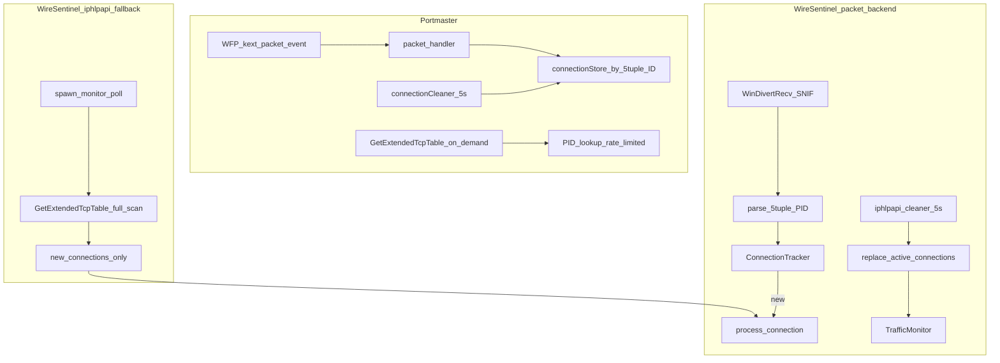

# Traffic Monitor: Portmaster vs WireSentinel

WireSentinel のトラフィック計測方式を [Portmaster](https://github.com/safing/portmaster) と比較した調査メモです。

## アーキテクチャ概要

## 比較表

| 観点 | Portmaster | WireSentinel（デフォルト `packet`） |
|------|------------|-------------------------------------|
| 検出トリガ | パケット傍受（WFP kext）＋ Linux eBPF connect | WinDivert SNIF（SYN/UDP）イベント駆動 |
| `iphlpapi` 用途 | PID フォールバック・生存確認のみ（10ms レート制限） | **5秒クリーナー**（終了接続の prune のみ） |
| 重複排除 | 5-tuple `ConnectionID` + `handlePacket` で即登録 | `ConnectionTracker` + `MonitorConnectionSink` |
| 既存接続の再処理 | パケット単位で既存 Connection に集約 | 新規接続時のみ `process_connection`（WFP+DB） |
| ライフサイクル | 5秒クリーナーが OS 表と照合 | クリーナーが `replace_active_connections` で置換 |
| 帯域 | kext から 1秒更新 | 接続処理時の `update_bandwidth` |
| プロトコル | TCP + UDP | TCP（SYN）+ UDP（初回パケット） |
| ポーリング間隔 | 接続検出はイベント駆動（表スキャンは補助） | クリーナー間隔デフォルト 5秒（`traffic_poll_interval_ms`） |
| フォールバック | — | WinDivert 不可時は `iphlpapi` 全表ポーリング |

## Portmaster 参照コード

| コンポーネント | パス |
|----------------|------|
| 接続モデル | `portmaster/service/network/connection.go` |
| パケット処理 | `portmaster/service/firewall/packet_handler.go` |
| Windows API | `portmaster/service/network/iphelper/tables.go` |
| 接続クリーナー | `portmaster/service/network/clean.go` |

## WireSentinel 参照コード

| コンポーネント | パス |
|----------------|------|
| バックエンド factory | `traffic-monitor/src/backend.rs` — `create_connection_backend` |
| パケット backend | `traffic-monitor/src/packet.rs` — `PacketConnectionBackend` |
| iphlpapi backend | `traffic-monitor/src/iphlpapi.rs` — `IphlpapiBackend` |
| WinDivert 受信 | `windivert-engine/src/capture.rs` |
| 5-tuple 解析 | `windivert-engine/src/packet_parse.rs` |
| TCP 列挙（クリーナー） | `traffic-monitor/src/windows.rs` |
| 接続処理 | `core-service/src/orchestrator.rs` — `process_connection` |
| バックエンド設定 | `storage/src/repos/settings.rs` — `traffic_monitor_backend`（デフォルト `packet`） |

## WireSentinel データフロー（`packet` バックエンド）

1. 専用スレッドが WinDivert SNIF で `(outbound and tcp.Syn == 1) or (outbound and udp)` を受信
2. `parse_packet` + `WINDIVERT_ADDRESS.ProcessId` で `ConnectionSnapshot` を組み立て
3. 新規フローのみ `on_connection` → `process_connection`
4. **5秒ごと**に `GetExtendedTcpTable` でアクティブ集合を取得し、`replace_active_connections` のみ（`process_connection` は呼ばない）

## `iphlpapi` フォールバック

- `WinDivert.dll` が無い／ロード失敗時、起動ログに `WinDivert capture unavailable — falling back to iphlpapi polling`
- 明示設定 `traffic_monitor_backend=iphlpapi` でも同じポーリング backend を使用
- `traffic_monitor_backend=etw` は非推奨で `iphlpapi` にマップ

## 既知の制限

- カーネル Guardian からの userspace 接続イベント IOCTL は未実装（Phase 1 は WinDivert のみ）
- 初回クリーナー／iphlpapi フォールバック時は既存 TCP が「新規」として一度処理される可能性あり

## UI / Service 接続

UI（`wire-sentinel.exe`）とバックエンド（`wire-sentinel-service.exe`）の接続確認は [wsl-portable-debug.md](./wsl-portable-debug.md) および `scripts/verify-ui-service-connection.ps1` を参照。

## Windows 実機検証

1. `./scripts/stage-windows-portable.sh --debug`
2. `wire-sentinel-service.exe --console` 起動ログに `traffic backend: packet` を確認
3. ブラウザで新規タブ → 3秒待たずに `connection_count` / traffic イベント増加
4. `WinDivert.dll` を一時リネーム → `iphlpapi fallback` ログ + 従来ポーリング動作
